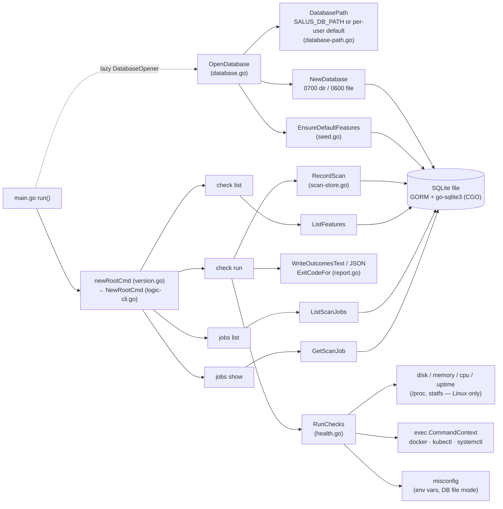
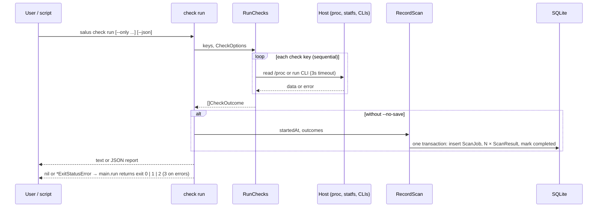
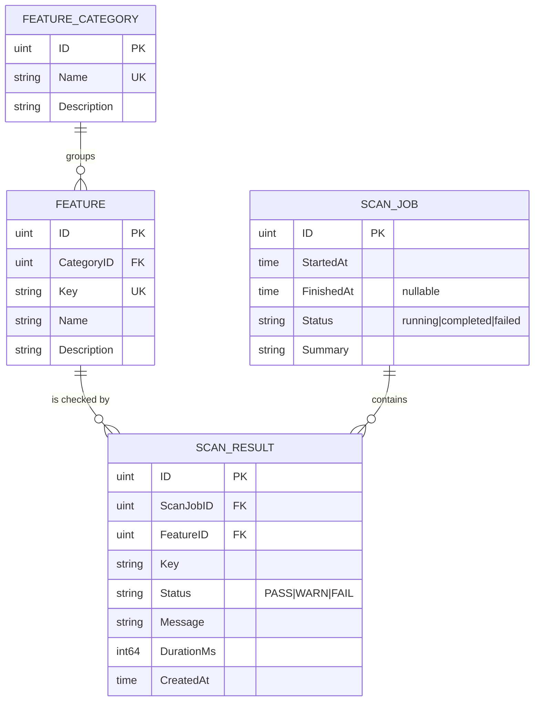

# Repository Map

Concise map of the Salus repository. Architecture rules live in
[`maint.md`](maint.md).

Last reviewed: 2026-09-27 (against commit `753252e` plus uncommitted P2-3/P2-4
changes).

## Directory structure

```text
Salus/
├── main.go                     main() → run(): open/close DB, seed catalog, run Cobra root, map exit code
├── main_test.go                End-to-end exit codes and persistence through run()
├── version.go                  Build version (set via -X main.version) + root command wiring
├── version_test.go
├── internal/                   Single Go package holding all application logic
│   ├── logic-cli.go            Cobra commands: check list|run, jobs list|show
│   ├── logic-cli_test.go       Command tests: write errors, check run output/exit status/persistence
│   ├── health.go               Check keys, options, thresholdStatus, registry, RunChecks,
│   │                           docker / kubernetes / service-uptime / misconfig checks
│   ├── health-thresholds.go    Threshold defaults + accessors (//go:build linux until P3-7)
│   ├── health-resources_linux.go   disk (statfs), memory (/proc/meminfo),
│   │                               CPU load (/proc/loadavg), uptime (/proc/uptime)
│   ├── health-resources_other.go   Non-Linux stubs returning WARN
│   ├── health_test.go          Thresholds, RunChecks, report and exit-code helpers
│   ├── checks_test.go          Docker/kubectl/systemctl/misconfig checks with fake tools (fakeToolOptions)
│   ├── health-resources_linux_test.go  /proc parser fixtures, threshold accessors, disk-space FAIL
│   ├── report.go               Text/JSON output, WorstStatus, exit codes (ExitCodeFor, ExitStatusError, ExitCode)
│   ├── database.go             GORM models, NewDatabase (owner-only file) + AutoMigrate, OpenDatabase, Close
│   ├── database-path.go        SALUS_DB_PATH / per-user default path per OS, databaseFile
│   ├── database-path_test.go   Path resolution per OS, file modes, read-only and ?param handling
│   ├── database_test.go
│   ├── seed.go                 Compiled-in feature catalog + EnsureDefaultFeatures
│   ├── scan-store.go           ListFeatures, RecordScan, ListScanJobs, GetScanJob
│   ├── scan-store_test.go
│   ├── logic-tui.go            Empty placeholder, to be removed (CLI-only, Q-001)
│   └── ui-form.go              Empty placeholder, to be removed (CLI-only, Q-001)
├── intel/                      Repository intelligence documents (see AGENTS.md)
├── .github/dependabot.yml      Weekly updates: gomod, github-actions, docker (via workflow patch)
├── .github/workflows/
│   ├── ci.yml                  vet, lint, test+coverage, native build smoke (3 OSes)
│   ├── security.yml            CodeQL + gosec (SARIF, non-blocking) + govulncheck (blocking)
│   ├── docker.yml              Image build + smoke tests (non-root, volume, in-container WARNs)
│   └── cd.yml                  Tag-triggered 6-target CGO build → .tar.gz/.zip + checksums
├── .devcontainer/devcontainer.json   Ubuntu base + Go, Docker-outside-of-Docker, Neovim
├── Dockerfile                  Multi-stage, digest-pinned: golang:1.26-alpine3.24 → alpine:3.24, runs as UID 10001
├── .dockerignore               Keeps .git, .env, *.db, IDE/CI files out of the build context
├── Makefile                    Release tagging only (tag, push-tag, release)
├── AGENTS.md                   Agent/contributor operating rules
├── README.md, CONTRIBUTING.md, CODE_OF_CONDUCT.md
├── LICENSE (Apache-2.0), NOTICE, CODEOWNERS
└── go.mod, go.sum              Module github.com/jabbott-iii/Salus, go 1.26.8 (latest patch; SEC-008)
```

`.idea/` (JetBrains project files) is tracked (Q-007). Its own `.gitignore`
excludes per-user files such as `workspace.xml`. `.junie/plans/` exists
locally but is empty and untracked.

## Component and dependency view



## `check run` data flow



## Data model



## External dependencies (from `go.mod`)

| Module | Version | Role |
|---|---|---|
| `github.com/spf13/cobra` | v1.10.2 | CLI framework (direct) |
| `gorm.io/gorm` | v1.31.2 | ORM (direct) |
| `gorm.io/driver/sqlite` | v1.6.0 | GORM SQLite dialect (direct) |
| `github.com/mattn/go-sqlite3` | v1.14.52 | CGO SQLite driver (indirect) |
| `github.com/spf13/pflag` | v1.0.10 | Flag parsing (indirect, via cobra) |
| `github.com/inconshreveable/mousetrap` | v1.1.0 | Windows helper (indirect, via cobra) |
| `github.com/jinzhu/inflection` | v1.0.0 | Indirect, via gorm |
| `github.com/jinzhu/now` | v1.1.5 | Indirect, via gorm |
| `golang.org/x/text` | v0.41.0 | Indirect, via gorm |

Runtime tools invoked when present: `docker`, `kubectl`, `systemctl`.
