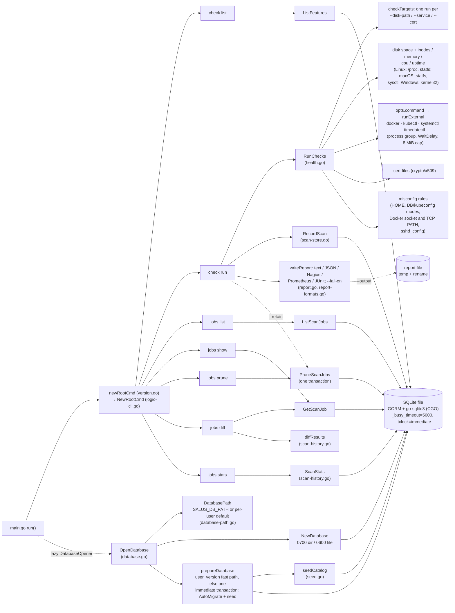
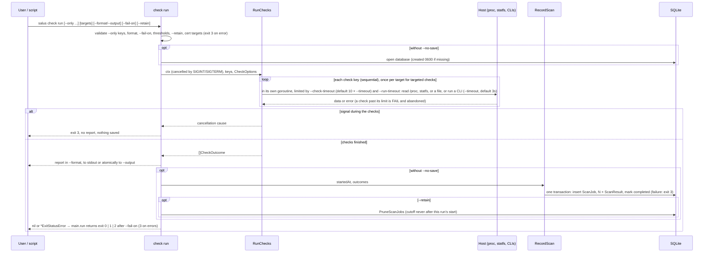
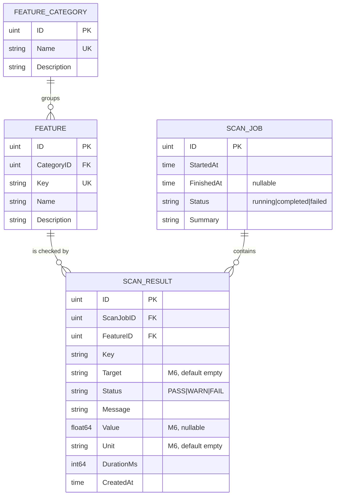

# Repository Map

Concise map of the Salus repository. Architecture rules live in
[`maint.md`](maint.md).

Last reviewed: 2026-10-04 (against `03964ff`, which carries M6 and P3-7; P7
run-hardening changes added uncommitted on top of `b16129f`).

## Directory structure

```text
Salus/
├── main.go                     main() → run() → runWith(): open/close DB, seed catalog, run Cobra root,
│                               map exit code; recovers panics as exit 3 (P7-6)
├── main_test.go                End-to-end exit codes and persistence through run(); panic → exit 3
├── version.go                  Build version (set via -X main.version) + root command wiring
├── version_test.go
├── internal/                   Single Go package holding all application logic
│   ├── logic-cli.go            Cobra commands: check list|run, jobs list|show|prune|diff|stats;
│   │                           check run flags (targets, thresholds, --timeout/--check-timeout/
│   │                           --run-timeout, --format/--output, --fail-on, --retain) +
│   │                           validateLimits, stopSignalContext (SIGINT/SIGTERM), jobs --json, parseAge
│   ├── logic-cli_test.go       Command tests: write errors, check run output/exit status/persistence,
│   │                           flag → CheckOptions mapping, flag validation, formats, --output,
│   │                           --fail-on, --retain, jobs JSON shapes, jobs prune, parseAge,
│   │                           report-before-save, interruption
│   ├── logic-cli_unix_test.go  SIGTERM handling and inherited-ignored SIGINT (//go:build unix)
│   ├── health.go               Check keys, CheckOutcome (target/value/unit), options, defaults,
│   │                           thresholdStatus, registry + checkTargets, RunChecks + runCheck
│   │                           (per-check goroutine, --check-timeout/--run-timeout), opts.command; docker,
│   │                           kubernetes-status (readiness + node pressure, kubectlFor),
│   │                           service-uptime, misconfig rules (misconfigRules with stable ids)
│   ├── health-exec.go          runExternal: WaitDelay, 8 MiB output cap (limitedBuffer), stop-signal grace
│   ├── health-exec_unix.go     Process-group kill on cancel, endedByStopSignal (//go:build unix)
│   ├── health-exec_other.go    No-op stopProcessGroup, endedByStopSignal false (//go:build !unix)
│   ├── health-exec_test.go     command timeout messages, limitedBuffer, check/run time limits, panics
│   ├── health-exec_unix_test.go    Real processes: group kill, leftover pipes, output cap, stop signals
│   ├── health-thresholds.go    Threshold accessors + orDefault (//go:build linux || darwin || windows)
│   ├── health-resources.go     diskSpaceOutcome, inodeOutcome (linux || darwin || windows)
│   ├── health-disk_unix.go     disk space + inodes via statfs (linux || darwin)
│   ├── health-resources_linux.go   memory (/proc/meminfo), CPU load (/proc/loadavg),
│   │                               uptime (/proc/uptime)
│   ├── health-resources_darwin.go  memory (VM page counts, hw.memsize, vm.swapusage),
│   │                               CPU load (vm.loadavg), uptime (kern.boottime) via sysctl
│   ├── health-resources_windows.go disk (GetDiskFreeSpaceExW), memory (GlobalMemoryStatusEx),
│   │                               CPU busy % (GetSystemTimes, 1s sample), uptime (GetTickCount64)
│   ├── health-decode.go        Pure decoding of sysctl structs and CPU counters (no build constraint)
│   ├── health-systemd.go       systemd-failed (systemctl list-units), time-sync (timedatectl)
│   ├── health-pods.go          kubernetes-pods (kubectl get pods, --kube-namespace)
│   ├── health-certs.go         cert-expiry (PEM/DER files, crypto/x509)
│   ├── health-sshd.go          sshd-root-login / sshd-password-auth rules: sshd_config parser
│   │                           (Include, first value wins, Match), SALUS_SSHD_CONFIG
│   ├── health-resources_other.go   Stubs returning WARN on other platforms (!linux && !darwin && !windows)
│   ├── health-mounts_linux.go  syntheticModes: WSL drvfs detection from /proc/self/mounts
│   ├── health-mounts_other.go  syntheticModes stub (false) for other platforms
│   ├── health-mounts_linux_test.go  /proc/self/mounts fixtures for drvfs detection
│   ├── health_test.go          Thresholds, RunChecks, report and exit-code helpers
│   ├── checks_test.go          Docker/kubectl/systemctl checks with fake tools (fakeToolOptions),
│   │                           misconfig rules with isolated env (isolateMisconfigEnv)
│   ├── health-resources_linux_test.go  /proc parser fixtures
│   ├── health-resources_test.go    Disk/inode classification, missing paths, live reads of this host
│   ├── health-thresholds_test.go   Threshold accessors
│   ├── health-decode_test.go       sysctl and CPU-counter decoding (runs everywhere)
│   ├── health-resources_{darwin,windows}_test.go  Live sysctl / kernel32 reads on CI runners
│   ├── health-{systemd,pods,certs,sshd}_test.go  New checks: fake tools, generated certificates,
│   │                                   sshd_config fixture trees
│   ├── report.go               Text/JSON output (outcomes; jobs for jobs list/show --json), WorstStatus,
│   │                           exit codes (ExitCodeFor, ExitStatusError, ExitCode)
│   ├── report-formats.go       writeReport: Nagios, Prometheus text format, JUnit XML;
│   │                           writeFileAtomic for --output
│   ├── report-formats_test.go  Golden output per format, escaping, atomic writes
│   ├── database.go             GORM models, NewDatabase/OpenDatabase (owner-only file), connection
│   │                           defaults, prepareDatabase (schemaVersion in PRAGMA user_version,
│   │                           migrate + seed in one immediate transaction, read-only fallback), Close
│   ├── database-path.go        SALUS_DB_PATH / per-user default path per OS, databaseFile
│   ├── database-path_test.go   Path resolution per OS, file modes, read-only and ?param handling
│   ├── database_test.go        Schema and catalog, concurrent first open, schema versions, read-only
│   │                           unversioned database, wantSchema golden (bump schemaVersion)
│   ├── seed.go                 Compiled-in feature catalog, EnsureDefaultFeatures/seedCatalog
│   │                           (firstOrInsert: ON CONFLICT DO NOTHING), catalogComplete
│   ├── scan-store.go           ListFeatures, RecordScan, ListScanJobs, GetScanJob, PruneScanJobs
│   ├── scan-store_test.go      Includes the v1.0.2 → M6 schema migration test
│   ├── scan-history.go         diffResults (jobs diff), ScanStats (jobs stats)
│   └── scan-history_test.go
├── intel/                      Repository intelligence documents (see AGENTS.md)
├── .github/dependabot.yml      Weekly updates: gomod, github-actions (codeql-action + artifact-actions groups), docker
├── .github/ISSUE_TEMPLATE/     Issue forms (P4-5): bug_report.yml, feature_request.yml (issue-first pitch),
│                               config.yml (no blank issues; security link opens private vulnerability reporting)
├── .github/pull_request_template.md   Linked issue, validation commands, checklist, security notes
├── .github/workflows/
│   ├── ci.yml                  vet, lint, test+coverage, native build smoke (3 OSes)
│   ├── security.yml            CodeQL + gosec (SARIF, non-blocking) + govulncheck (blocking)
│   ├── docker.yml              Image build + smoke tests (non-root, volume, in-container WARNs)
│   └── cd.yml                  Tag/manual 6-target CGO build → package job: .tar.gz/.zip + checksums
│                               + provenance attestation → release job: GitHub Release (tags only);
│                               Linux builds and both release jobs pinned to Ubuntu 24.04
├── .devcontainer/devcontainer.json   Ubuntu base + Go, Docker-outside-of-Docker, Neovim
├── Dockerfile                  Multi-stage, digest-pinned: golang:1.26-alpine3.24 → alpine:3.24, runs as UID 10001
├── .dockerignore               Keeps .git, .env, *.db, IDE/CI files out of the build context
├── Makefile                    Dev targets (build, test, vet, lint, fmt, cover) + release tagging
├── .golangci.yml               golangci-lint v2 config: pinned linter set (P4-3), tests analyzed
├── AGENTS.md                   Agent/contributor operating rules
├── README.md, CONTRIBUTING.md, CODE_OF_CONDUCT.md
├── SECURITY.md                 Supported versions, private vulnerability reporting, scope (P4-4)
├── LICENSE (Apache-2.0), NOTICE, CODEOWNERS
└── go.mod, go.sum              Module github.com/jabbott-iii/Salus, go 1.26.8 (latest patch; SEC-008)
```

`.idea/` (JetBrains project files) is tracked (Q-007). Its own `.gitignore`
excludes per-user files such as `workspace.xml`. `.junie/plans/` exists
locally but is empty and untracked.

## Component and dependency view



## `check run` data flow



## Data model



## External dependencies (from `go.mod`)

| Module | Version | Role |
|---|---|---|
| `github.com/spf13/cobra` | v1.10.2 | CLI framework (direct) |
| `gorm.io/gorm` | v1.31.2 | ORM (direct) |
| `gorm.io/driver/sqlite` | v1.6.0 | GORM SQLite dialect (direct) |
| `github.com/mattn/go-sqlite3` | v1.14.52 | CGO SQLite driver (indirect) |
| `github.com/spf13/pflag` | v1.0.10 | Flag parsing (indirect, via cobra) |
| `github.com/inconshreveable/mousetrap` | v1.1.0 | Windows helper (indirect, via cobra) |
| `github.com/jinzhu/inflection` | v1.0.0 | Indirect, via gorm |
| `github.com/jinzhu/now` | v1.1.5 | Indirect, via gorm |
| `golang.org/x/text` | v0.41.0 | Indirect, via gorm |

Runtime tools invoked when present: `docker`, `kubectl`, `systemctl`,
`timedatectl`. Files read when present or given: `/proc/*`, `/proc/self/mounts`,
`--cert` files, and `sshd_config` with its includes. M6 added no module
dependency (`encoding/xml`, `crypto/x509`, `encoding/pem`, and `text/tabwriter`
are standard library).
